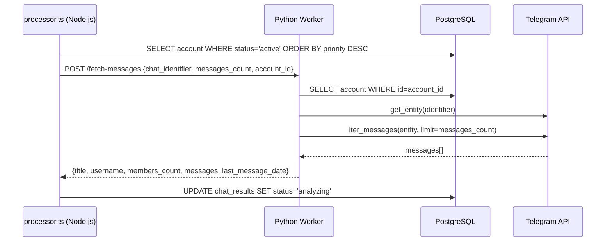
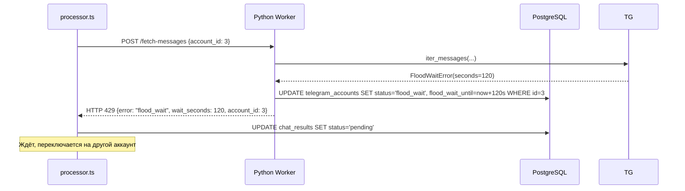

# Design Document: Telethon Python Worker

## Overview

Данный дизайн описывает замену gramjs Telegram-клиента (Node.js) на отдельный Python-воркер на базе Telethon. Архитектура остаётся двухкомпонентной: существующий Node.js/Express API-сервер управляет сессиями, аккаунтами и результатами через PostgreSQL, а новый Python-воркер берёт на себя всю работу с Telegram MTProto.

**Ключевые цели:**
- Изолировать Telegram MTProto-логику в отдельный Python-процесс
- Сохранить совместимость с существующими gramjs-сессиями без повторной аутентификации
- Минимизировать изменения в Node.js API-сервере (только замена вызовов `telegram.ts` на HTTP-запросы к воркеру)
- Предоставить два эндпоинта: `POST /fetch-messages` и `GET /health`

**Исследовательские выводы:**

Формат gramjs `StringSession` (Node.js, non-web) и Telethon `StringSession` используют **одинаковый бинарный формат** (`>B4sH256s` для IPv4 DC), но gramjs добавляет версионный префикс `"1"` в начало строки. Telethon при инициализации `StringSession` ожидает строку без этого префикса. Следовательно, конвертация сводится к удалению первого символа и декодированию base64-payload — никакой повторной аутентификации не требуется. Это подтверждается [конвертером от разработчика gramjs](https://gist.github.com/painor/0eabf0095d18bdc49ec0d2220998a38d) и [анализом бинарного формата](https://gist.github.com/divyam234/127aae273a424f1e41c77eeae99503bf).

---

## Architecture

```mermaid
graph TB
    subgraph "Node.js API Server (existing)"
        A[Express Routes] --> B[processor.ts]
        B --> C[account-manager.ts]
        B --> D[TelegramWorkerClient\n(новый модуль)]
        D -->|HTTP POST /fetch-messages| E
    end

    subgraph "Python Worker (новый)"
        E[FastAPI App\n:8001] --> F[AccountManager]
        F --> G[ClientPool]
        G --> H[Telethon TelegramClient]
    end

    subgraph "PostgreSQL"
        I[(telegram_accounts)]
        J[(sessions)]
        K[(chat_results)]
    end

    H -->|MTProto| L[Telegram API]
    F --> I
    B --> J
    B --> K
    C --> I
```

**Поток обработки одного чата:**



**Обработка FloodWait:**



---

## Components and Interfaces

### Python Worker — структура файлов

```
python-worker/
├── worker.py           # Точка входа, запуск FastAPI + uvicorn
├── app.py              # FastAPI приложение, роутинг
├── account_manager.py  # Выбор аккаунта, FloodWait/ban логика
├── client_pool.py      # Пул Telethon-клиентов (per-account)
├── session_compat.py   # Конвертация gramjs → Telethon StringSession
├── telegram_client.py  # Обёртка над Telethon: fetch_messages
├── db.py               # Подключение к PostgreSQL (asyncpg + SQLAlchemy Core)
├── models.py           # Pydantic-модели запросов/ответов
├── config.py           # Конфигурация из env-переменных
├── logger.py           # Структурированное JSON-логирование (structlog)
└── requirements.txt    # Зафиксированные зависимости
```

### HTTP API воркера

#### `POST /fetch-messages`

**Request:**
```json
{
  "chat_identifier": "string",
  "messages_count": 50,
  "account_id": 1
}
```

**Response 200:**
```json
{
  "title": "string | null",
  "username": "string | null",
  "members_count": 1234,
  "messages": ["text1", "text2"],
  "last_message_date": "2024-01-15T10:30:00Z"
}
```

**Response 400** — отсутствуют обязательные поля:
```json
{ "error": "missing required field: chat_identifier" }
```

**Response 429** — FloodWait:
```json
{ "error": "flood_wait", "wait_seconds": 120, "account_id": 1 }
```

**Response 401** — Auth error:
```json
{ "error": "auth_error", "code": "AUTH_KEY_UNREGISTERED", "account_id": 1 }
```

**Response 503** — нет доступных аккаунтов:
```json
{ "error": "no_accounts_available" }
```

**Response 500** — внутренняя ошибка:
```json
{ "error": "internal_error", "detail": "..." }
```

#### `GET /health`

**Response 200:**
```json
{ "status": "ok" }
```

### Node.js — новый модуль `telegram-worker-client.ts`

Заменяет прямые вызовы `fetchChatMessages()` из `telegram.ts` на HTTP-запросы к Python-воркеру:

```typescript
// artifacts/api-server/src/lib/telegram-worker-client.ts
export async function fetchChatMessagesViaWorker(
  chatIdentifier: string,
  messagesCount: number,
  account: TelegramAccount
): Promise<FetchMessagesResult>
```

`processor.ts` переключается с `fetchChatMessages` (gramjs) на `fetchChatMessagesViaWorker`. Логика FloodWait/ban обработки в `processor.ts` остаётся без изменений — воркер возвращает структурированные ошибки, которые processor интерпретирует так же, как раньше.

---

## Data Models

### Pydantic-модели (Python)

```python
# models.py
from pydantic import BaseModel
from typing import Optional
from datetime import datetime

class FetchMessagesRequest(BaseModel):
    chat_identifier: str
    messages_count: int
    account_id: int

class FetchMessagesResponse(BaseModel):
    title: Optional[str]
    username: Optional[str]
    members_count: Optional[int]
    messages: list[str]
    last_message_date: Optional[datetime]

class ErrorResponse(BaseModel):
    error: str
    detail: Optional[str] = None
    wait_seconds: Optional[int] = None
    account_id: Optional[int] = None
    code: Optional[str] = None
```

### Существующие таблицы БД (без изменений)

Воркер читает и обновляет только таблицу `telegram_accounts`:

| Поле | Тип | Использование воркером |
|------|-----|------------------------|
| `id` | int | Идентификатор аккаунта |
| `api_id` | varchar | Telegram API ID |
| `api_hash` | varchar | Telegram API Hash |
| `session` | text | gramjs StringSession (конвертируется) |
| `status` | enum | Читает/обновляет: active/flood_wait/banned |
| `flood_wait_until` | timestamp | Устанавливает при FloodWait |
| `priority` | int | Для выбора аккаунта |
| `proxy_host` | varchar | SOCKS5 прокси |
| `proxy_port` | int | SOCKS5 порт |
| `proxy_username` | varchar | Прокси логин |
| `proxy_password` | varchar | Прокси пароль |

### Конвертация gramjs → Telethon StringSession

gramjs `StringSession` (Node.js, non-web) имеет формат:
```
"1" + base64url(pack(">B4sH256s", dc_id, ip_bytes, port, auth_key))
```

Telethon `StringSession` ожидает:
```
base64url(pack(">B4sH256s", dc_id, ip_bytes, port, auth_key))
```

Конвертация в `session_compat.py`:
```python
def gramjs_to_telethon_session(gramjs_session: str) -> StringSession:
    """
    Конвертирует gramjs StringSession (с префиксом "1") в Telethon StringSession.
    Формат бинарного payload идентичен, отличается только наличие версионного префикса.
    """
    if gramjs_session.startswith("1"):
        raw = gramjs_session[1:]  # убираем версионный префикс
    else:
        raw = gramjs_session  # уже в формате Telethon
    return StringSession(raw)
```

---

## Correctness Properties

*A property is a characteristic or behavior that should hold true across all valid executions of a system — essentially, a formal statement about what the system should do. Properties serve as the bridge between human-readable specifications and machine-verifiable correctness guarantees.*

Для данной фичи PBT применим: воркер содержит чистую логику нормализации идентификаторов, фильтрации сообщений, выбора аккаунтов и конвертации сессий — всё это функции с чётким input/output поведением, где вариация входных данных выявляет граничные случаи.

**Библиотека:** [Hypothesis](https://hypothesis.readthedocs.io/) (Python) — стандартный выбор для PBT в Python-экосистеме.

---

После анализа prework выявлены следующие группы свойств. Проведём рефлексию для устранения избыточности:

- Свойства 1.3 и 1.4 (невалидный session / невалидный api_id/api_hash) можно объединить в одно свойство "невалидная конфигурация аккаунта".
- Свойства 2.3 и 2.4 (invalid session → banned, valid session → no DB write) — разные инварианты, не избыточны.
- Свойства 3.4 (FloodWait propagation) и 5.1 (FloodWait DB update) — разные уровни, не избыточны.
- Свойства 5.3 (flood_wait recovery) и 5.4 (priority selection) — разные инварианты, не избыточны.
- Свойство 5.6 (client pool cleanup) и 5.1/5.2 (DB update) — разные аспекты, не избыточны.

После рефлексии: объединяем 1.3+1.4 → Property 1.

---

### Property 1: Невалидная конфигурация аккаунта не вызывает краш

*For any* TelegramAccount с пустым, невалидным или отсутствующим `session`, `api_id` или `api_hash`, воркер SHALL пропустить этот аккаунт, залогировать ошибку и продолжить работу без исключения.

**Validates: Requirements 1.3, 1.4**

---

### Property 2: Нормализация chat_identifier

*For any* username `u`, все четыре формата идентификатора (`@u`, `https://t.me/u`, `t.me/u`, `u`) SHALL нормализоваться к одному и тому же bare-идентификатору перед передачей в `get_entity`.

**Validates: Requirements 3.2**

---

### Property 3: Фильтрация пустых сообщений

*For any* список сообщений, содержащий произвольное количество сообщений с пустым или whitespace-only текстом, возвращаемый список `messages` SHALL не содержать ни одного такого сообщения.

**Validates: Requirements 3.6**

---

### Property 4: Точная передача wait_seconds при FloodWait

*For any* значение `wait_seconds` в диапазоне [1, 86400], когда Telegram API возвращает FloodWaitError с этим значением, HTTP-ответ воркера SHALL содержать то же самое значение `wait_seconds` без изменений.

**Validates: Requirements 3.4**

---

### Property 5: Выбор аккаунта с наивысшим приоритетом

*For any* непустой список TelegramAccount со статусом `active` и различными значениями `priority`, воркер SHALL всегда выбирать аккаунт с наибольшим значением `priority`.

**Validates: Requirements 5.4**

---

### Property 6: Автовосстановление аккаунта после FloodWait

*For any* TelegramAccount со статусом `flood_wait` и `flood_wait_until` в прошлом, перед выбором аккаунта для нового запроса воркер SHALL обновить его статус на `active` и очистить `flood_wait_until`.

**Validates: Requirements 5.3**

---

### Property 7: Очистка пула клиентов при flood_wait/banned

*For any* `account_id`, после того как аккаунт помечен как `flood_wait` или `banned`, пул клиентов SHALL не содержать клиента для этого `account_id`.

**Validates: Requirements 5.6**

---

### Property 8: Сессия не перезаписывается после успешного подключения

*For any* валидная gramjs StringSession, после успешного подключения Telethon-клиента поле `session` в таблице `telegram_accounts` SHALL оставаться неизменным.

**Validates: Requirements 2.4**

---

### Property 9: Невалидная сессия → статус banned

*For any* TelegramAccount с невалидной или истёкшей сессией, при попытке подключения воркер SHALL обновить `status = 'banned'` в БД.

**Validates: Requirements 2.3**

---

### Property 10: Валидация входящего запроса

*For any* HTTP-запрос к `POST /fetch-messages`, в котором отсутствует хотя бы одно из обязательных полей (`chat_identifier`, `messages_count`, `account_id`), воркер SHALL вернуть HTTP 400.

**Validates: Requirements 6.4**

---

### Property 11: Отсутствие чувствительных данных в логах

*For any* конфигурация аккаунта с непустыми `session`, `api_hash` и `proxy_password`, ни одна строка лога, эмитированная воркером в ходе любой операции, SHALL не содержать значения этих полей.

**Validates: Requirements 8.6**

---

## Error Handling

### Классификация ошибок и HTTP-коды

| Ситуация | HTTP-код | Тело ответа |
|----------|----------|-------------|
| Отсутствуют обязательные поля | 400 | `{"error": "validation_error", "detail": "..."}` |
| Нет активных аккаунтов | 503 | `{"error": "no_accounts_available"}` |
| FloodWait | 429 | `{"error": "flood_wait", "wait_seconds": N, "account_id": N}` |
| Auth error | 401 | `{"error": "auth_error", "code": "...", "account_id": N}` |
| Чат не найден / недоступен | 404 | `{"error": "chat_not_found", "detail": "..."}` |
| Внутренняя ошибка | 500 | `{"error": "internal_error", "detail": "..."}` |

### Стратегия обработки ошибок в Node.js (`telegram-worker-client.ts`)

```typescript
// Маппинг HTTP-кодов воркера на существующую логику processor.ts
switch (response.status) {
  case 429: // FloodWait — аналог getFloodWaitSeconds() != null
    throw new WorkerFloodWaitError(body.wait_seconds);
  case 401: // Auth error — аналог isAuthError()
    throw new WorkerAuthError(body.code);
  case 503: // Нет аккаунтов
    throw new WorkerNoAccountsError();
  default:
    throw new WorkerError(body.detail);
}
```

`processor.ts` обрабатывает `WorkerFloodWaitError` и `WorkerAuthError` так же, как раньше обрабатывал gramjs-ошибки — логика переключения аккаунтов и retry остаётся неизменной.

### Reconnect-логика воркера

При неожиданном разрыве соединения Telethon-клиента:
1. Попытка переподключения с экспоненциальным backoff: 3s, 6s, 12s, 24s, 48s (5 попыток)
2. Если все попытки неудачны — клиент удаляется из пула, аккаунт помечается как недоступен (не banned — это может быть сетевая проблема)
3. Следующий запрос к этому аккаунту создаст новый клиент

---

## Testing Strategy

### Dual Testing Approach

**Unit/Property тесты** (Hypothesis + pytest):
- Тестируют чистую логику: нормализацию идентификаторов, фильтрацию сообщений, выбор аккаунтов, конвертацию сессий
- Используют моки для Telethon и PostgreSQL
- Минимум 100 итераций на каждый property-тест

**Integration тесты** (pytest + реальная тестовая БД):
- Проверяют корректность HTTP API (FastAPI TestClient)
- Проверяют взаимодействие с PostgreSQL
- 1-3 примера на каждый сценарий

**Smoke тесты** (ручные / CI):
- Запуск воркера с корректной конфигурацией
- Проверка `GET /health`
- Проверка наличия `requirements.txt` с зафиксированными версиями

### Конфигурация property-тестов

```python
# Пример конфигурации Hypothesis
from hypothesis import given, settings, HealthCheck
from hypothesis import strategies as st

@settings(max_examples=100, suppress_health_check=[HealthCheck.too_slow])
@given(st.text(min_size=1))
def test_chat_identifier_normalization(username):
    # Feature: telethon-python-worker, Property 2: chat_identifier normalization
    ...
```

Каждый property-тест помечается комментарием:
```python
# Feature: telethon-python-worker, Property N: <property_text>
```

### Покрытие по требованиям

| Требование | Тип теста | Property # |
|------------|-----------|------------|
| 1.3, 1.4 — невалидный аккаунт | Property | 1 |
| 1.5 — переиспользование клиентов | Example | — |
| 1.6 — reconnect 5 попыток | Example | — |
| 2.3 — invalid session → banned | Property | 9 |
| 2.4 — session не перезаписывается | Property | 8 |
| 3.2 — нормализация идентификаторов | Property | 2 |
| 3.6 — фильтрация пустых сообщений | Property | 3 |
| 3.4 — FloodWait propagation | Property | 4 |
| 5.3 — автовосстановление аккаунта | Property | 6 |
| 5.4 — выбор по приоритету | Property | 5 |
| 5.6 — очистка пула | Property | 7 |
| 6.4 — валидация запроса | Property | 10 |
| 8.6 — нет секретов в логах | Property | 11 |
| 6.1, 6.3 — health endpoint | Smoke | — |
| 5.2 — auth error → banned | Example | — |
| 5.5 — нет активных аккаунтов | Example | — |
